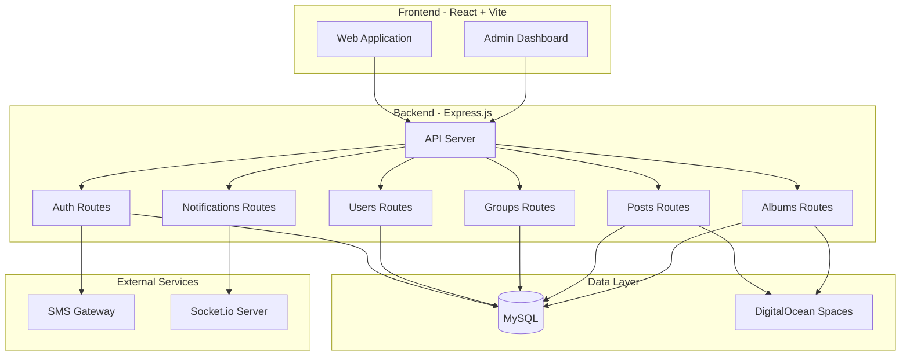
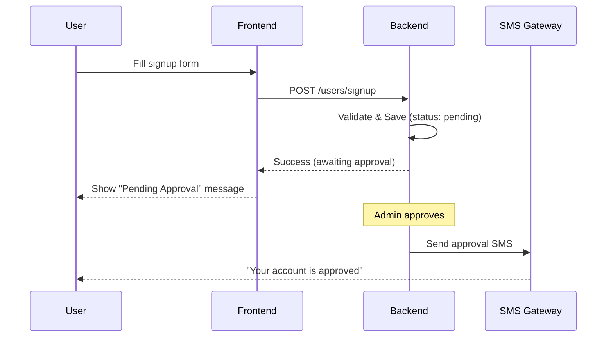
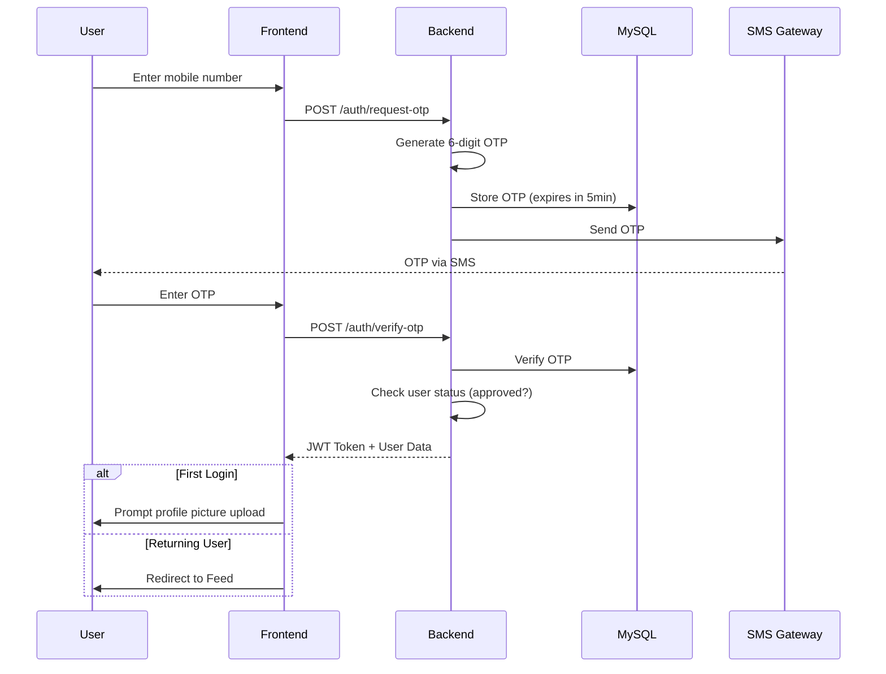
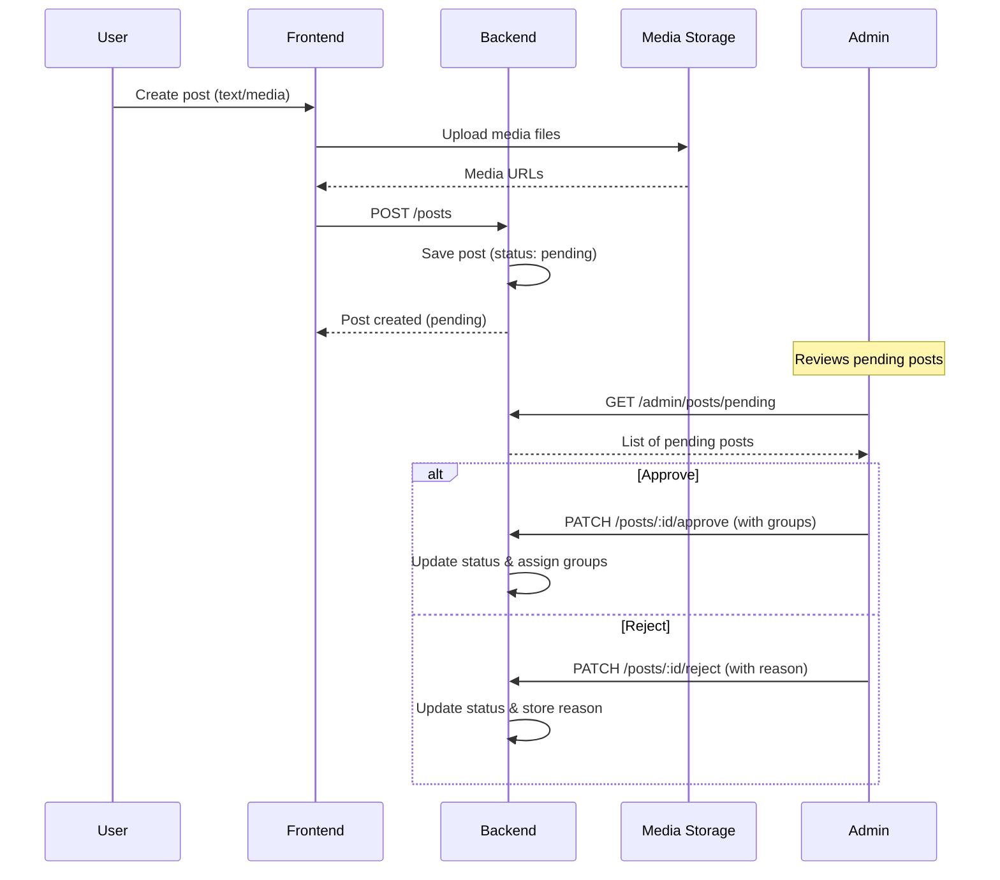

# College Social Media Application - Product Requirements Document (PRD)

## 1. Executive Summary

This document outlines the technical requirements and architecture for a **College Social Media Application** - an admin-centric platform designed to connect students, faculty, principal, and management through controlled and moderated communication channels.

### Key Objectives
- **Controlled Communication**: All user-generated content requires admin approval
- **Group-Based Access**: Content visibility controlled through group membership
- **Secure Authentication**: OTP-based passwordless login
- **Event Management**: Albums and media sharing for college events

---

## 2. Technology Stack (Beginner-Friendly)

> [!NOTE]
> This stack is chosen for **simplicity and learning** - students can understand each line of code.

### Frontend (React + TailwindCSS + TypeScript)
| Technology | Purpose |
|------------|---------|
| **React 19** | UI library (latest) |
| **TypeScript** | Type safety |
| **Vite** | Build tool (fast, simple) |
| **React Router v6** | Page routing |
| **TailwindCSS** | Utility-first styling |
| **Axios** | HTTP requests |
| **React Context** | Simple state management |
| **Socket.io-client** | Real-time notifications |

### Backend (Node.js + Express.js + TypeScript)
| Technology | Purpose |
|------------|---------|
| **Node.js** | JavaScript runtime |
| **TypeScript** | Type safety |
| **Express.js** | Web framework |
| **MySQL** | Database |
| **Sequelize** | ORM (SQL query builder) |
| **bcrypt** | Password hashing |
| **jsonwebtoken** | JWT authentication |
| **Multer** | File uploads |
| **cors** | Cross-origin requests |
| **Socket.io** | Real-time notifications |
| **node-cron** | Scheduled tasks (OTP cleanup) |
| **ts-node / tsx** | Run TypeScript directly |

### DevOps & Infrastructure
| Technology | Purpose |
|------------|----------|
| **npm** | Package manager |
| **Nodemon** | Auto-restart server |
| **Git** | Version control |
| **Hostinger VPS** | Server hosting |
| **DigitalOcean Spaces** | CDN & Media storage |

### React 19 Hooks Usage

> [!TIP]
> React 19 introduces powerful new hooks for better UX. Here's where to use them:

| Hook | Purpose | Where to Use |
|------|---------|--------------|
| `useActionState` | Form submissions with loading/error states | Login, Signup, Create Post, Comments |
| `useOptimistic` | Instant UI feedback before server confirms | Like Button, Comments, Notifications |
| `useFormStatus` | Disable buttons while form submits | All submit buttons |
| `use` | Read promises/context directly | Feed, Albums, Profile data loading |
| `useTransition` | Non-blocking state updates | Filters, Search, Pagination |

**Example - Optimistic Like Button:**
```tsx
const [optimisticLiked, setOptimisticLiked] = useOptimistic(isLiked);

async function handleLike() {
  setOptimisticLiked(true);  // Instant UI update
  await likePost(postId);    // Server call (rollback on error)
}
```

---

## 3. System Architecture



---

## 4. Database Schema Design

### Core Entities

#### 4.1 Roles Table
```
roles
├── id (UUID, PK)
├── name (VARCHAR 50, UNIQUE, NOT NULL)  -- 'super_admin', 'admin', 'moderator', 'faculty', 'student'
├── description (VARCHAR 255, NULLABLE)
├── is_default (BOOLEAN, DEFAULT false)   -- 'student' is default for self-signup
├── can_post_without_approval (BOOLEAN, DEFAULT false)
├── can_moderate_posts (BOOLEAN, DEFAULT false)
├── can_manage_users (BOOLEAN, DEFAULT false)
├── can_manage_groups (BOOLEAN, DEFAULT false)
├── created_at (TIMESTAMP)
└── updated_at (TIMESTAMP)
```

#### 4.2 Users Table
```
users
├── id (UUID, PK)
├── name (VARCHAR 100, NOT NULL)
├── mobile_number (VARCHAR 15, UNIQUE, NOT NULL)
├── email (VARCHAR 255, NULLABLE)
├── profile_picture_url (VARCHAR 500, NULLABLE)
├── status (ENUM: 'pending', 'approved', 'rejected', DEFAULT 'pending')
├── created_by_admin (BOOLEAN, DEFAULT false)
├── first_login_complete (BOOLEAN, DEFAULT false)
├── created_at (TIMESTAMP)
├── updated_at (TIMESTAMP)
└── deleted_at (TIMESTAMP, NULLABLE) -- Soft delete
```

#### 4.3 User Roles (Junction Table - Many-to-Many)
```
user_roles
├── id (UUID, PK)
├── user_id (UUID, FK -> users.id)
├── role_id (UUID, FK -> roles.id)
├── assigned_by (UUID, FK -> users.id, NULLABLE)
├── assigned_at (TIMESTAMP)
└── UNIQUE(user_id, role_id)
```

#### 4.4 Group Types Table
```
group_types
├── id (UUID, PK)
├── label (VARCHAR 100, NOT NULL)
├── description (TEXT, NULLABLE)
├── created_at (TIMESTAMP)
└── updated_at (TIMESTAMP)
```

#### 4.5 Groups Table
```
groups
├── id (UUID, PK)
├── name (VARCHAR 150, NOT NULL)
├── description (TEXT, NULLABLE)
├── group_type_id (UUID, FK -> group_types.id)
├── created_by (UUID, FK -> users.id)
├── created_at (TIMESTAMP)
└── updated_at (TIMESTAMP)
```

#### 4.6 User Groups (Junction Table)
```
user_groups
├── id (UUID, PK)
├── user_id (UUID, FK -> users.id)
├── group_id (UUID, FK -> groups.id)
├── joined_at (TIMESTAMP)
└── UNIQUE(user_id, group_id)
```

#### 4.7 Posts Table
```
posts
├── id (UUID, PK)
├── content (TEXT, NULLABLE)
├── author_id (UUID, FK -> users.id)
├── status (ENUM: 'pending', 'approved', 'rejected', DEFAULT 'pending')
├── is_public (BOOLEAN, DEFAULT false)
├── rejection_reason (TEXT, NULLABLE)
├── reviewed_by (UUID, FK -> users.id, NULLABLE)
├── reviewed_at (TIMESTAMP, NULLABLE)
├── created_at (TIMESTAMP)
└── updated_at (TIMESTAMP)
```

#### 4.8 Post Media Table
```
post_media
├── id (UUID, PK)
├── post_id (UUID, FK -> posts.id)
├── media_url (VARCHAR 500, NOT NULL)
├── media_type (ENUM: 'image', 'video')
├── display_order (INT, DEFAULT 0)
└── created_at (TIMESTAMP)
```

#### 4.9 Post Groups (Junction Table)
```
post_groups
├── id (UUID, PK)
├── post_id (UUID, FK -> posts.id)
├── group_id (UUID, FK -> groups.id)
└── UNIQUE(post_id, group_id)
```

#### 4.10 Albums Table
```
albums
├── id (UUID, PK)
├── event_name (VARCHAR 200, NOT NULL)
├── event_date (DATE, NOT NULL)
├── description (TEXT, NULLABLE)
├── created_by (UUID, FK -> users.id)
├── created_at (TIMESTAMP)
└── updated_at (TIMESTAMP)
```

#### 4.11 Album Media Table
```
album_media
├── id (UUID, PK)
├── album_id (UUID, FK -> albums.id)
├── media_url (VARCHAR 500, NOT NULL)
├── media_type (ENUM: 'image', 'video')
├── caption (VARCHAR 300, NULLABLE)
├── display_order (INT, DEFAULT 0)
└── created_at (TIMESTAMP)
```

#### 4.12 Album Groups (Junction Table)
```
album_groups
├── id (UUID, PK)
├── album_id (UUID, FK -> albums.id)
├── group_id (UUID, FK -> groups.id)
└── UNIQUE(album_id, group_id)
```

#### 4.13 Likes Table
```
likes
├── id (UUID, PK)
├── user_id (UUID, FK -> users.id)
├── likeable_type (ENUM: 'post', 'comment')
├── likeable_id (UUID)
├── created_at (TIMESTAMP)
└── UNIQUE(user_id, likeable_type, likeable_id)
```

#### 4.14 Comments Table
```
comments
├── id (UUID, PK)
├── post_id (UUID, FK -> posts.id)
├── user_id (UUID, FK -> users.id)
├── content (TEXT, NOT NULL)
├── created_at (TIMESTAMP)
└── updated_at (TIMESTAMP)
```

#### 4.15 OTP Verifications Table
```
otp_verifications
├── id (INT, PK, AUTO_INCREMENT)
├── mobile_number (VARCHAR 15, NOT NULL)
├── otp (VARCHAR 6, NOT NULL)
├── attempts (INT, DEFAULT 0)
├── expires_at (TIMESTAMP, NOT NULL)
├── created_at (TIMESTAMP)
└── INDEX(mobile_number, expires_at)
```

#### 4.16 Notifications Table
```
notifications
├── id (UUID, PK)
├── user_id (UUID, FK -> users.id)
├── type (ENUM: 'post_approved', 'post_rejected', 'new_post', 'comment', 'like')
├── title (VARCHAR 200, NOT NULL)
├── message (TEXT, NOT NULL)
├── reference_type (ENUM: 'post', 'comment', 'album', NULLABLE)
├── reference_id (UUID, NULLABLE)
├── is_read (BOOLEAN, DEFAULT false)
├── created_at (TIMESTAMP)
└── INDEX(user_id, is_read, created_at)
```

---

## 5. API Endpoints Design

### 5.1 Authentication Module

| Method | Endpoint | Description | Access |
|--------|----------|-------------|--------|
| POST | `/api/auth/request-otp` | Request OTP for login | Public |
| POST | `/api/auth/verify-otp` | Verify OTP and get JWT | Public |
| POST | `/api/auth/refresh-token` | Refresh access token | Authenticated |
| POST | `/api/auth/logout` | Invalidate session | Authenticated |

### 5.2 Users Module

| Method | Endpoint | Description | Access |
|--------|----------|-------------|--------|
| POST | `/api/users/signup` | User self-registration | Public |
| GET | `/api/users/me` | Get current user profile | Authenticated |
| PATCH | `/api/users/me` | Update profile | Authenticated |
| POST | `/api/users/me/profile-picture` | Upload profile picture | Authenticated |
| GET | `/api/admin/users` | List all users (with filters) | Admin |
| POST | `/api/admin/users` | Create user (auto-approved) | Admin |
| GET | `/api/admin/users/pending` | Get pending users | Admin |
| PATCH | `/api/admin/users/:id/approve` | Approve user | Admin |
| PATCH | `/api/admin/users/:id/reject` | Reject user | Admin |
| DELETE | `/api/admin/users/:id` | Soft delete user | Admin |

### 5.3 Group Types Module

| Method | Endpoint | Description | Access |
|--------|----------|-------------|--------|
| GET | `/api/admin/group-types` | List all group types | Admin |
| POST | `/api/admin/group-types` | Create group type | Admin |
| PATCH | `/api/admin/group-types/:id` | Update group type | Admin |
| DELETE | `/api/admin/group-types/:id` | Delete group type | Admin |

### 5.4 Groups Module

| Method | Endpoint | Description | Access |
|--------|----------|-------------|--------|
| GET | `/api/groups` | Get user's groups | Authenticated |
| GET | `/api/admin/groups` | List all groups | Admin |
| POST | `/api/admin/groups` | Create group | Admin |
| PATCH | `/api/admin/groups/:id` | Update group | Admin |
| DELETE | `/api/admin/groups/:id` | Delete group | Admin |
| POST | `/api/admin/groups/:id/members` | Add members to group | Admin |
| DELETE | `/api/admin/groups/:id/members/:userId` | Remove member | Admin |
| GET | `/api/admin/groups/:id/members` | List group members | Admin |

### 5.5 Posts Module

| Method | Endpoint | Description | Access |
|--------|----------|-------------|--------|
| GET | `/api/posts/feed` | Get user's feed | Authenticated |
| GET | `/api/posts/my-posts` | Get user's own posts | Authenticated |
| POST | `/api/posts` | Create a post | Authenticated |
| DELETE | `/api/posts/:id` | Delete own post | Owner |
| GET | `/api/admin/posts/pending` | Get pending posts | Admin |
| PATCH | `/api/admin/posts/:id/approve` | Approve post | Admin |
| PATCH | `/api/admin/posts/:id/reject` | Reject post | Admin |
| POST | `/api/admin/posts` | Create admin post (auto-approved) | Admin |

### 5.6 Likes & Comments Module

| Method | Endpoint | Description | Access |
|--------|----------|-------------|--------|
| POST | `/api/posts/:id/like` | Like a post | Authenticated |
| DELETE | `/api/posts/:id/like` | Unlike a post | Authenticated |
| GET | `/api/posts/:id/comments` | Get post comments | Authenticated |
| POST | `/api/posts/:id/comments` | Add comment | Authenticated |
| DELETE | `/api/comments/:id` | Delete own comment | Owner |
| POST | `/api/comments/:id/like` | Like a comment | Authenticated |
| DELETE | `/api/comments/:id/like` | Unlike a comment | Authenticated |

### 5.7 Albums Module

| Method | Endpoint | Description | Access |
|--------|----------|-------------|--------|
| GET | `/api/albums` | Get albums visible to user | Authenticated |
| GET | `/api/albums/:id` | Get album details | Authenticated |
| GET | `/api/admin/albums` | List all albums | Admin |
| POST | `/api/admin/albums` | Create album | Admin |
| PATCH | `/api/admin/albums/:id` | Update album | Admin |
| DELETE | `/api/admin/albums/:id` | Delete album | Admin |
| POST | `/api/admin/albums/:id/media` | Add media to album | Admin |
| DELETE | `/api/admin/albums/:id/media/:mediaId` | Remove media | Admin |

### 5.8 Notifications Module

| Method | Endpoint | Description | Access |
|--------|----------|-------------|--------|
| GET | `/api/notifications` | Get user notifications (paginated) | Authenticated |
| GET | `/api/notifications/unread-count` | Get unread notification count | Authenticated |
| PATCH | `/api/notifications/:id/read` | Mark notification as read | Authenticated |
| PATCH | `/api/notifications/read-all` | Mark all notifications as read | Authenticated |
| DELETE | `/api/notifications/:id` | Delete notification | Authenticated |

### 5.9 Pagination (All List Endpoints)

> [!NOTE]
> All list endpoints support pagination using `LIMIT OFFSET`:

```
GET /api/posts/feed?page=1&limit=20
GET /api/notifications?page=1&limit=10
GET /api/albums?page=1&limit=12
```

**Response Format:**
```json
{
  "data": [...],
  "pagination": {
    "page": 1,
    "limit": 20,
    "total": 150,
    "totalPages": 8
  }
}
```

---

## 6. User Flows

### 6.1 User Self-Registration Flow


### 6.2 Login Flow


### 6.3 Post Creation & Moderation Flow


---

## 7. Frontend Pages Structure

### 7.1 Public Pages
```
/                       → Landing page (redirect to login if unauthenticated)
/login                  → Mobile + OTP login
/signup                 → User self-registration
/pending-approval       → Status page for pending users
```

### 7.2 User Pages (Authenticated)
```
/feed                   → Main feed with posts & albums
/my-posts               → User's own posts with status
/albums                 → Browse accessible albums
/albums/[id]            → Individual album view
/profile                → User profile settings
/profile/edit           → Edit profile
```

### 7.3 Admin Pages
```
/admin                  → Admin dashboard
/admin/users            → User management
/admin/users/pending    → Pending approvals
/admin/group-types      → Manage group types
/admin/groups           → Manage groups
/admin/groups/[id]      → Group details & members
/admin/posts/pending    → Post moderation queue
/admin/albums           → Album management
/admin/albums/create    → Create new album
/admin/albums/[id]/edit → Edit album
```

---

## 8. Key Features & Business Rules

### 8.1 Authentication Rules
- ✅ OTP-only authentication (no passwords)
- ✅ OTP expires in 5 minutes
- ✅ Maximum 3 OTP attempts per request
- ✅ Rate limiting: Max 3 OTP requests per 15 minutes per mobile

### 8.2 User Approval Rules
- ✅ Self-registered users start in `pending` status
- ✅ Admin-created users are auto-approved
- ✅ Only `approved` users can access the app
- ✅ First login requires profile picture upload

### 8.3 Content Moderation Rules
- ✅ User posts require admin approval
- ✅ Admin posts are auto-approved
- ✅ Approved posts must be assigned to at least one group (or marked public)
- ✅ Rejected posts must have a rejection reason
- ✅ Users can see their rejected posts with reasons

### 8.4 Content Visibility Rules
- ✅ Users see posts from groups they belong to
- ✅ Users see public posts
- ✅ Users see albums shared with their groups
- ✅ Admins can see all content

---

## 9. Non-Functional Requirements

### 9.1 Performance
- API response time: < 200ms (95th percentile)
- Feed pagination: 20 posts per page
- Image optimization: WebP format, max 1MB
- Video compression: Max 50MB, H.264 encoding

### 9.2 Security
- JWT tokens with 15-minute access token, 7-day refresh token
- HTTPS only in production
- Input sanitization (XSS prevention)
- Rate limiting on all endpoints
- File upload validation (type, size)

### 9.3 Scalability
- CDN for static assets and media
- Database connection pooling
- Load balancing with PM2 cluster mode

---

## 10. Development Phases

### Phase 1: Foundation (Week 1-2)
- [ ] Project scaffolding (React + Express.js)
- [ ] Database setup & migrations
- [ ] Authentication module (OTP + JWT)
- [ ] Basic user CRUD

### Phase 2: Core Features (Week 3-4)
- [ ] Group types & groups management
- [ ] User-group allocation
- [ ] Post creation & moderation
- [ ] Media upload integration

### Phase 3: Social Features (Week 5-6)
- [ ] Feed with visibility rules
- [ ] Likes & comments
- [ ] Albums & events
- [ ] User profile management

### Phase 4: Polish & Deploy (Week 7-8)
- [ ] Admin dashboard UI
- [ ] Notifications (in-app + SMS)
- [ ] Performance optimization
- [ ] Testing & bug fixes
- [ ] Deployment setup

---

## 11. Folder Structure

### Backend (Express.js + TypeScript)
```
server/
├── src/
│   ├── config/
│   │   ├── database.ts
│   │   ├── env.ts
│   │   └── multer.ts
│   ├── middleware/
│   │   ├── auth.ts
│   │   ├── errorHandler.ts
│   │   └── rateLimiter.ts
│   ├── models/
│   │   ├── User.ts
│   │   ├── Role.ts
│   │   ├── Group.ts
│   │   ├── Post.ts
│   │   ├── Album.ts
│   │   ├── Comment.ts
│   │   ├── Like.ts
│   │   └── Notification.ts
│   ├── routes/
│   │   ├── auth.routes.ts
│   │   ├── users.routes.ts
│   │   ├── groups.routes.ts
│   │   ├── posts.routes.ts
│   │   ├── albums.routes.ts
│   │   ├── notifications.routes.ts
│   │   └── index.ts
│   ├── controllers/
│   │   ├── auth.controller.ts
│   │   ├── users.controller.ts
│   │   ├── groups.controller.ts
│   │   ├── posts.controller.ts
│   │   ├── albums.controller.ts
│   │   └── notifications.controller.ts
│   ├── services/
│   │   ├── sms.service.ts
│   │   ├── upload.service.ts
│   │   └── notification.service.ts
│   ├── utils/
│   │   ├── jwt.ts
│   │   ├── otp.ts
│   │   └── pagination.ts
│   ├── types/
│   │   └── index.ts
│   ├── socket/
│   │   └── index.ts
│   └── app.ts
├── package.json
├── tsconfig.json
└── .env
```

### Frontend (React + Vite + TypeScript)
```
client/
├── src/
│   ├── pages/
│   │   ├── Login.tsx
│   │   ├── Signup.tsx
│   │   ├── Feed.tsx
│   │   ├── MyPosts.tsx
│   │   ├── Albums.tsx
│   │   ├── AlbumDetail.tsx
│   │   ├── Profile.tsx
│   │   └── admin/
│   │       ├── Dashboard.tsx
│   │       ├── Users.tsx
│   │       ├── Groups.tsx
│   │       ├── PendingPosts.tsx
│   │       └── Albums.tsx
│   ├── components/
│   │   ├── ui/
│   │   │   ├── Button.tsx
│   │   │   ├── Input.tsx
│   │   │   ├── Modal.tsx
│   │   │   └── Card.tsx
│   │   ├── layout/
│   │   │   ├── Navbar.tsx
│   │   │   ├── Sidebar.tsx
│   │   │   └── Layout.tsx
│   │   ├── posts/
│   │   │   ├── PostCard.tsx
│   │   │   ├── CreatePost.tsx
│   │   │   └── PostList.tsx
│   │   └── common/
│   │       ├── Loading.tsx
│   │       └── ErrorMessage.tsx
│   ├── hooks/
│   │   ├── useAuth.ts
│   │   ├── usePosts.ts
│   │   └── useSocket.ts
│   ├── context/
│   │   └── AuthContext.tsx
│   ├── services/
│   │   └── api.ts
│   ├── types/
│   │   └── index.ts
│   ├── utils/
│   │   └── helpers.ts
│   ├── App.tsx
│   ├── main.tsx
│   └── index.css
├── public/
├── package.json
├── tsconfig.json
├── vite.config.ts
├── tailwind.config.js
└── .env
```

---

## 12. Environment Variables

### Backend (server/.env)
```env
# Database (MySQL)
DB_HOST=localhost
DB_PORT=3306
DB_USER=root
DB_PASSWORD=your-password
DB_NAME=college_social

# JWT
JWT_SECRET=your-secret-key
JWT_ACCESS_EXPIRY=15m
JWT_REFRESH_EXPIRY=7d

# SMS Gateway (configure based on chosen provider)
SMS_PROVIDER=twilio  # or msg91
SMS_API_KEY=xxx
SMS_SENDER_ID=xxx

# DigitalOcean Spaces (CDN & Media)
DO_SPACES_KEY=xxx
DO_SPACES_SECRET=xxx
DO_SPACES_BUCKET=college-social-media
DO_SPACES_REGION=blr1
DO_SPACES_ENDPOINT=https://blr1.digitaloceanspaces.com

# App
PORT=3001
NODE_ENV=development
CLIENT_URL=http://localhost:5173
```

### Frontend (client/.env)
```env
VITE_API_URL=http://localhost:3001
VITE_SOCKET_URL=http://localhost:3001
VITE_UPLOAD_MAX_SIZE=52428800
```

---

## 13. Verification Plan

### Automated Testing
- **Unit Tests**: Jest + React Testing Library (frontend), Jest (backend)
- **Integration Tests**: Supertest for API endpoints
- **E2E Tests**: Playwright for critical user flows

### Manual Testing Checklist
1. User registration → admin approval → login flow
2. Post creation → moderation → feed visibility
3. Group management and member allocation
4. Album creation and sharing
5. Mobile responsiveness

---

## 15. Potential Improvements & Enhancements

### 🔴 High Priority Improvements

#### 1. Push Notifications
- **Current Gap**: Users must manually check for updates
- **Improvement**: Add Firebase Cloud Messaging (FCM) for real-time notifications
- **Use Cases**: Post approval/rejection, new posts in groups, comment replies

#### 2. Search Functionality
- **Current Gap**: No way to search posts, users, or albums
- **Improvement**: Add full-text search with Elasticsearch or PostgreSQL tsvector
- **Use Cases**: Find posts by keyword, search users by name, filter albums by event

#### 3. Threaded/Nested Comments
- **Current Gap**: Flat comment structure only
- **Improvement**: Add `parent_comment_id` for reply threads
- **Benefit**: Better discussion organization on posts

#### 4. User Roles Granularity
- **Current Gap**: Only Admin and User roles
- **Improvement**: Add roles like `Super Admin`, `Moderator`, `Faculty`, `Student`
- **Benefit**: Faculty can post without moderation, moderators can approve posts

---

### 🟡 Medium Priority Improvements

#### 5. Direct Messaging (DM)
- **Feature**: Private 1:1 messaging between users
- **Considerations**: May need additional moderation for safety

#### 6. Mentions & Tags
- **Feature**: `@username` mentions in posts/comments
- **Benefit**: Targeted notifications, better engagement

#### 7. Hashtags
- **Feature**: `#event2024` tagging for content discovery
- **Benefit**: Trending topics, easier content filtering

#### 8. Post Scheduling
- **Feature**: Admins can schedule posts for future publish
- **Use Case**: Pre-plan announcements, event reminders

#### 9. Story/Temporary Posts
- **Feature**: 24-hour expiring content (like Instagram Stories)
- **Benefit**: Encourages daily engagement

#### 10. Event RSVP System
- **Current Gap**: Albums are post-event only
- **Improvement**: Create upcoming events with RSVP functionality
- **Fields**: Event name, date/time, venue, RSVP deadline, attendee limit

---

### 🟢 Nice-to-Have Improvements

#### 11. Multi-Language Support (i18n)
- **Feature**: Interface in Hindi, regional languages
- **Benefit**: Accessibility for non-English speakers

#### 12. Polls & Surveys
- **Feature**: Create polls in posts
- **Use Case**: Feedback on events, voting on decisions

#### 13. Announcement Pins
- **Feature**: Pin important posts to top of feed
- **Benefit**: Critical announcements stay visible

#### 14. Read Receipts for Announcements
- **Feature**: Track who viewed important announcements
- **Use Case**: Ensure compliance with notices

#### 15. Analytics Dashboard
- **Feature**: Admin analytics - engagement, active users, popular content
- **Metrics**: DAU/MAU, post engagement rate, group activity

#### 16. Content Export
- **Feature**: Export user data, posts, albums for records
- **Compliance**: Useful for data portability

#### 17. Dark Mode
- **Feature**: System/manual dark theme toggle
- **Benefit**: User comfort, accessibility

#### 18. Offline Support (PWA)
- **Feature**: Cache feed for offline viewing
- **Tech**: Service workers, background sync

---

### 🔧 Technical Improvements

| Area | Current | Suggested Improvement |
|------|---------|----------------------|
| **Media Processing** | Direct upload | Add image compression, video transcoding queue (FFmpeg) |
| **Caching** | Basic Redis | Add Redis cache for feeds, invalidate on new posts |
| **Database** | Single PostgreSQL | Read replicas for scaling, connection pooling |
| **Audit Logging** | None | Track admin actions (approvals, rejections, deletions) |
| **Content Moderation** | Manual only | AI-based image/text moderation (AWS Rekognition, OpenAI) |
| **Rate Limiting** | Basic | IP + user-based with Redis sliding window |
| **Backup** | TBD | Automated daily backups to S3 |
| **Monitoring** | TBD | Sentry for errors, Prometheus + Grafana for metrics |

---

### 📱 Mobile App Consideration

> [!TIP]
> For wider adoption, consider a **React Native** or **Flutter** mobile app in Phase 2, sharing API with the web app.

**Mobile-specific features:**
- Push notifications (FCM/APNs)
- Camera integration for quick posting
- Biometric login (fingerprint/face)
- Offline-first architecture

---

### 🎓 College-Specific Features

#### Academic & Administrative

| Feature | Description | Benefit |
|---------|-------------|---------|
| **Timetable Integration** | Display class schedules per department/batch | Students always know their schedule |
| **Exam Schedule Board** | Centralized exam dates with countdown | Reduces confusion, increases preparedness |
| **Notice Board** | Official notices with read acknowledgment | Replace physical notice boards |
| **Assignment Reminders** | Faculty post assignments with due dates | Automated deadline notifications |
| **Attendance Alerts** | Low attendance warnings from admin | Early intervention for at-risk students |
| **Result Announcements** | Secure result sharing per student/batch | Privacy-preserving grade distribution |

#### Campus Life & Engagement

| Feature | Description | Benefit |
|---------|-------------|---------|
| **Club Management** | Official clubs with member management | Organized extracurricular activities |
| **Sports Events** | Match schedules, scores, team rosters | Inter-college sports visibility |
| **Fest/Event Countdown** | Countdown timers for college fests | Build excitement, improve attendance |
| **Lost & Found** | Report/claim lost items on campus | Reduce theft, help recovery |
| **Carpool/Ride Share** | Students coordinate rides home | Cost savings, eco-friendly |
| **Buy/Sell Marketplace** | Sell used books, electronics | Peer-to-peer student economy |

#### Safety & Well-being

| Feature | Description | Benefit |
|---------|-------------|---------|
| **Emergency SOS** | One-tap alert to campus security | Rapid response in emergencies |
| **Anonymous Feedback** | Report issues without revealing identity | Anti-ragging, anti-harassment reports |
| **Mental Health Resources** | Link to counseling, helplines | Student well-being support |
| **Campus Map** | Interactive map with building locations | Help new students navigate |

#### Alumni & Networking

| Feature | Description | Benefit |
|---------|-------------|---------|
| **Alumni Directory** | Searchable alumni database | Career networking opportunities |
| **Mentorship Program** | Connect current students with alumni | Career guidance |
| **Job Board** | Alumni share internship/job openings | Placement assistance |
| **Donation/Fundraising** | Alumni contribute to college funds | Institutional development |

#### Smart Integrations

| Feature | Description | Benefit |
|---------|-------------|---------|
| **AI Chatbot** | Answer FAQs about college, admissions | 24/7 query resolution |
| **QR Code Attendance** | Scan QR for event check-in | Automated attendance tracking |
| **Library Integration** | Book availability, due date reminders | Better library management |
| **Canteen Pre-order** | Order food, pick up at counter | Reduce queue times |
| **ID Card Digital Wallet** | Digital student ID with NFC | Modern, eco-friendly identification |

---

### 🏆 Gamification Ideas

| Feature | Description |
|---------|-------------|
| **Karma Points** | Earn points for posting, commenting, attending events |
| **Leaderboards** | Top contributors per group/semester |
| **Badges/Achievements** | "First Post", "Event Organizer", "Top Helper" |
| **Streaks** | Daily login streaks with rewards |
| **Challenges** | Weekly challenges (e.g., "Share 3 study tips") |

---

## 16. Confirmed Infrastructure

| Component | Choice |
|-----------|--------|
| **Server Hosting** | Hostinger VPS |
| **CDN & Media Storage** | DigitalOcean Spaces |

---

## 17. Remaining Questions

> [!IMPORTANT]
> Please confirm the following:

1. **SMS Provider**: Twilio, MSG91, or another? *(for OTP)*
2. **ORM Choice**: TypeORM vs Prisma for NestJS?
3. **Additional Features**: Push notifications for MVP?

---

> [!NOTE]
> This PRD provides the foundation for development. Once approved, we can proceed with the implementation phase.
